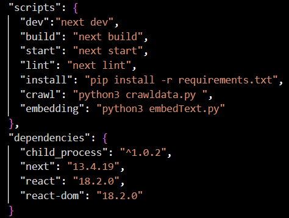

This is a [Next.js](https://nextjs.org/) project bootstrapped with [`create-next-app`](https://github.com/vercel/next.js/tree/canary/packages/create-next-app).

# NodeJS Implementation

## Design

Use Next.js framework and call python script with NodeJS.


## To Get Ready for Running the Project

### Step 1: Add your OPENAI_API_KEY to the project
```
$ cp .env.example .env
$ vi .env
```
Copy your OpenAi API Key into the file.

### Step 2: Install Dependencies
Install packages needed for Next.js project
```
$ npm install
```

Install packages needed to run Python Scripts
```
$ npm run install
```

*Reference Code*



### Step 3: Crawl Data and Embedding

I keep crawling data and embedding seperate from the main program to avoid TIMEOUT error and save cost on embedding.

* Crawl Data First

```
$ npm run crawl
```
<br>

* Then Embedding Data

Since we need to use the OpenAI model to embedding the data, we need to config the key before running this.

```
$ export OPENAI_API_KEY=<YOUR_API_KEY>
$ npm run embedding
```

## Run

```
$ npm run dev
```
Open [http://localhost:3000](http://localhost:3000) with your browser to see the result.

### Result


